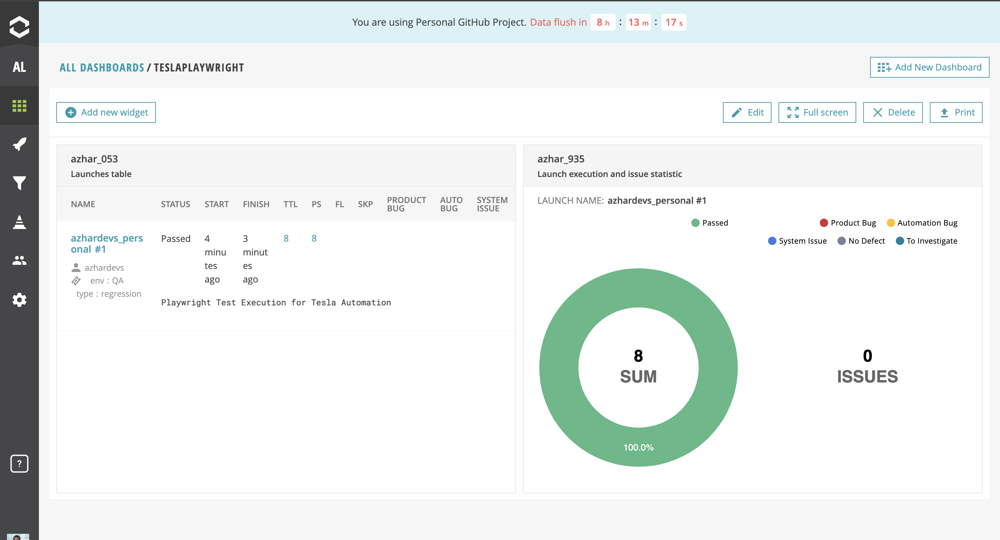
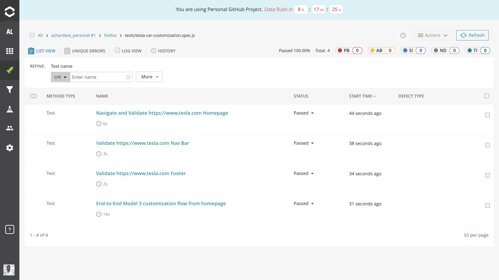

# Tesla Playwright E2E Tests

This repository contains automated end-to-end (E2E) tests for Tesla's website, written in Playwright. The tests simulates and validates user workflows, to navigate and customize a Tesla Model 3.

## Features

- Navigate to [Tesla's homepage](https://www.tesla.com/).
- Validate the Homepage elements
- Simulate and validates user interactions with car customization.

## Report Portal Integration 
This shows a visualization of passing tests in ReportPortal

This shows the specfic passing tests in ReportPortal

## How to Run

1. Clone the repository:
   git clone [https://github.com/AzharDevs/tesla-playwright-tests.git](https://github.com/AzharDevs/tesla-playwright-tests)
   cd tesla-playwright-tests

2. Install dependencies:
   npm install

3. Run the Tests
   npx playwright test tests/tesla-car-customization.spec.js
